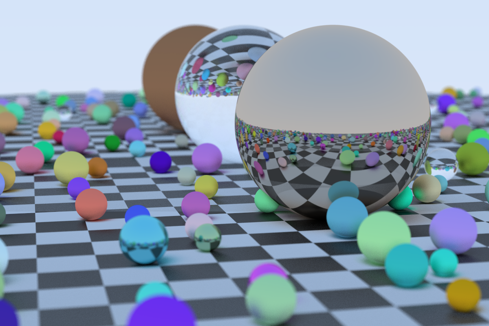

# Magnetite

This is a ray tracer implemented in Rust, following the _amazing_ [Ray Tracing in One Weekend](https://raytracing.github.io/) book series. Why "Magnetite"? Well, it's made of Iron Oxide (Rust) and I think it looks pretty!

## Examples

Each example has arguments you can pass them from the command line. To find out more, run `cargo run --release --example <EXAMPLE_NAME> -h`.

### Random Balls

Run this example using `cargo run --release --example random_balls`. It is the cover of the first book in the series with a few minor tweaks.

